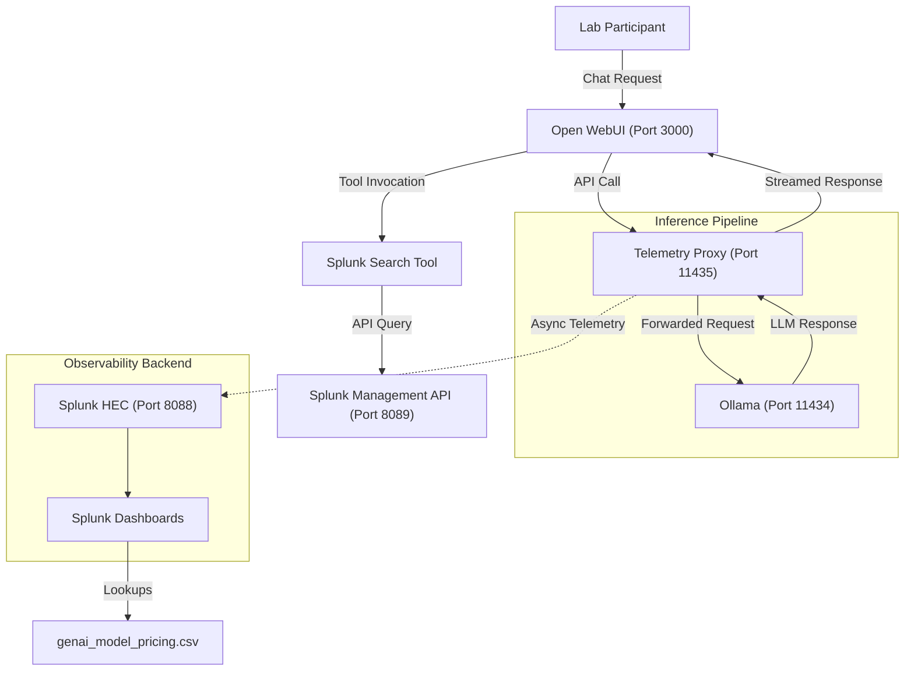

# GenAI Observability Architecture Skill

> [!IMPORTANT]
> This document is the source of truth for the laboratory's telemetry architecture. **Any architecture changes must be reflected in this document immediately.**

This skill documents the modular, containerized observability pipeline implemented for the Cisco Predictive Insights lab.

## System Architecture

## Data Path Flow: Implementation Nuances

### 1. Streaming & Metadata Recovery
The `ollama_proxy.py` utilizes `requests.iter_lines()` to maintain a non-blocking stream:
*   **Decoupled delivery**: Chunks are yielded to the frontend as soon as they arrive from Ollama.
*   **Metadata Recovery**: The proxy identifies the `done=true` flag to extract `eval_count` (output tokens) and `prompt_eval_count` (input tokens).
*   **Trace Consistency**: A unique `trace_id` (UUIDv4) is generated per request and propagated across all spans (LLM, RETRIEVER).

### 2. Field Normalization & Legacy Support
*   **OTel Attributes**: Emits `gen_ai.usage.input_tokens` and `gen_ai.usage.output_tokens`.
*   **Legacy Aliasing**: Duplicates values as `input_tokens` and `output_tokens` for compatibility with existing Splunk macros.

### 3. Advanced RAG Detection Heuristics
1.  **Prompt Length**: Prompts > 800 characters flag potential document-injections.
2.  **Context Markers**: Presence of `[Source:` or `[[Source` in the LLM's response stream.
3.  **Request Schema**: Explicit `context` fields in the incoming JSON payload.

### 4. Operational Resilience
*   **Asynchronous Dispatch**: Spawns a background `threading.Thread` for Splunk HEC calls.
*   **Error Isolation**: Telemetry failure never interrupts the inference stream.
*   **Env Configuration**: All sensitive tokens and URLs are managed via environment variables.

---
**Maintained by**: Architecture Group | **Version**: 1.5.0
