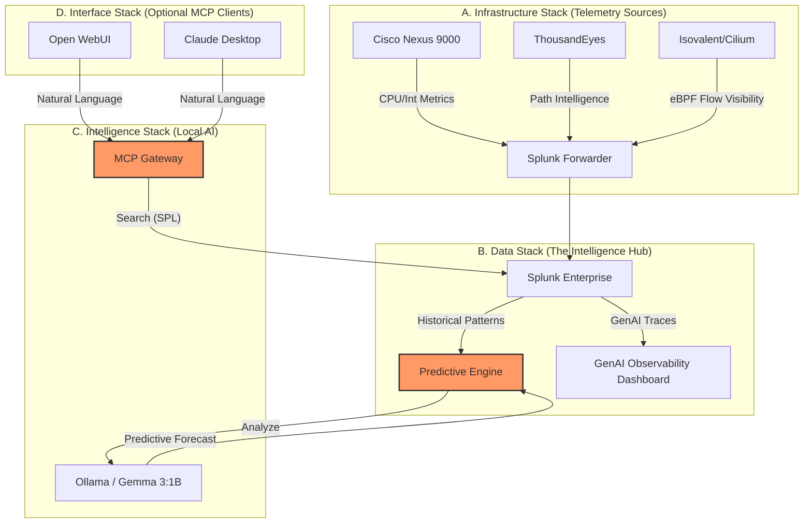

# Lab Guide - Digital Twin: Predictive Insights

## 1. Executive Summary: The Shift to Proactive Operations

Modern network infrastructure is too complex for traditional, reactive troubleshooting. The "Digital Twin" approach shifts the paradigm from **investigating what broke** to **predicting what will break next**.

> [!IMPORTANT]
> **The Cisco Advantage**: In a world where every other vendor was still chasing outages, Cisco is preventing them.

### The Cisco Advantage: Full-Stack Telemetry
This lab leverages a unique telemetry foundation that only Cisco can provide. By combining **Nexus 9000** as the physical transport layer, **ThousandEyes** for path intelligence beyond the campus, and **Isovalent (Cilium)** for eBPF-powered flow visibility, we create a high-fidelity "Digital Twin" of your environment.

### Local AI Sovereignty
Unlike public cloud solutions that introduce latency, security risks, and unpredictable costs, this lab uses **Local AI (Ollama/Llama3)** running natively on the host Mac to leverage **GPU (Metal) acceleration**. 
*   **Security**: Your sensitive network metadata never leaves your controlled environment.
*   **Cost Efficiency**: By hosting the AI locally, operations teams realize over **95% cost savings** compared to commercial LLM token pricing.
*   **Scalability**: The lab is designed for **Multi-user Isolation**, where every query and telemetry trace is tagged with a unique `user_id`, allowing distinct dashboard views for multiple participants.

### The Data Foundation: Preparing for AI
A successful AI digital twin relies heavily on the quality, structure, and accessibility of its underlying data. Aligning with industry practices like the **CRISP-DM** (Cross-Industry Standard Process for Data Mining) framework, this lab highlights that robust *data collection, preparation, and efficient querying* are the most critical prerequisites for AI success. High-fidelity telemetry ensures that the AI is reasoning over an accurate, holistic view of the environment, enabling precise predictive outcomes and actionable operational insights.

### Lab Highlights at a Glance

| Feature | Advantage |
| :--- | :--- |
| **Local LLM** | Privacy, zero-cost tokens, low latency via GPU acceleration. |
| **MCP Gateway** | Simplifies complex data retrieval via natural language. |
| **Predictive Engine** | Shifts operations from reactive to proactive (pre-outage insights). |
| **AI Defense** | Audits AI logic and prevents unauthorized configuration changes. |
| **GenAI Observability** | Provides financial and performance tracking for AI agents. |

---

## 2. Lab Access & Credentials

To participate in the lab, you will use a single gateway URL to access all services.

### **Service URLs**
- **Premium Chat (Open WebUI)**: [https://roosevelt-nonentreating-paler.ngrok-free.dev/](https://roosevelt-nonentreating-paler.ngrok-free.dev/)
- **Data Lake (Splunk)**: [https://roosevelt-nonentreating-paler.ngrok-free.dev/splunk/](https://roosevelt-nonentreating-paler.ngrok-free.dev/splunk/)
- **Web IDE (Code-Server)**: [https://roosevelt-nonentreating-paler.ngrok-free.dev/ide/](https://roosevelt-nonentreating-paler.ngrok-free.dev/ide/)

### **Login Information**
Participants should use their assigned **User ID** (e.g., `user01`) for all services.

| Field | Value |
| :--- | :--- |
| **Email Format** | `userXX@cisco.com` (e.g., `user01@cisco.com`) |
| **Password** | `CiscoLab2026!` |
| **IDE Password** | `LabPassword123` |

> [!IMPORTANT]
> **Data Isolation**: Always ensure you use your assigned `userXX` login. This ensures your telemetry data and AI "thoughts" are isolated from other participants.

---

## 3. Logical Architecture: End-to-End Insights



---

## 2. The Telemetry Foundation: Full-Stack Visibility

Before the AI can predict failures, the Digital Twin must be synchronized with reality. In this section, you will verify the ingestion of three critical data streams into your **Splunk Enterprise** data lake.

### Verifying the Data Streams
1.  **Open the Splunk Dashboard**: Navigate to the "Digital Twin Overview" app.
2.  **Nexus 9000 Telemetry**: Verify real-time CPU and interface load metrics from your switches.
3.  **ThousandEyes Path Intelligence**: Monitor path latency and loss percentages for critical application traffic.
4.  **Isovalent Security Flows**: Observe deep flow visibility into service-to-service communication.

> [!NOTE]
> All telemetry is indexed automatically. The AI uses these historical patterns to build a baseline for "normal" behavior before identifying anomalies.

---

## 3. Generating Predictive Insights

In this module, you will activate the **Predictive Engine**. This AI-driven script acts as an "Investigative Assistant," scanning telemetry for patterns that precede actual outages—such as interface degradation combined with rising application latency.

### Running the Predictive Analysis
From your terminal, execute the following:
```bash
python3 predictive_engine.py
```

### Sample Predictive Insight Report
The AI will generate a report similar to the following:
```text
### [PREDICTIVE ALERT] Interface eth1/2 on nexus-9000-01 ###
Severity: High
Confidence: 87%

OBSERVATION: Observed a 15% increase in interface errors over the last 10 minutes, 
correlated with a 40ms latency spike in ThousandEyes path telemetry.

PROJECTION: Interface failure is likely within the next 2 hours. Service impact 
will be critical for vlan-200 application traffic.

RECOMMENDATION: Pre-emptively proactive failover to path B and inspect physical SFP on eth1/2.
```

> [!IMPORTANT]
> **No-SPL Required**: Notice that the engine generated this report without you ever writing a Splunk search query. The AI identified the "pre-failure" pattern by reasoning over the raw metrics directly.

---

## 4. Natural Language Investigation: The MCP Moment

The **Model Context Protocol (MCP)** acts as a "Universal Translator." It allows you to talk to your infrastructure in plain English, while the AI handles the complex translation to Splunk Search Processing Language (SPL) in the background.

### The Investigative Assistant
You will use the **Splunk AI Analyst** to probe deeper into the environment health. Because of the MCP gateway, the AI can "reach" into Splunk, fetch the data, and summarize it for you.

### Try These Investigative Prompts:

#### **Stage 1: System Overview**
*   *"Check Splunk for the most recent events in the main index. What source types are sending data?"*
*   *"Summarize the current health status of all Nexus 9000 switches based on the latest telemetry."*
*   *"Show me a list of the top 5 interfaces with the highest CPU or traffic load in the last 15 minutes."*

#### **Stage 2: Troubleshooting & Correlation**
*   *"Are there any correlation between rising interface errors on my switches and ThousandEyes latency spikes?"*
*   *"Check for any 'Security Violation' events from Cisco AI Defense. Did they impact any network performance?"*
*   *"Search for Nexus telemetry where CPU usage is over 80%. Is this causing any dropped flows in Isovalent (Hubble)?"*

#### **Stage 3: Predictive Analysis**
*   *"Based on the interface error trends in Splunk, which port is most likely to fail in the next hour?"*
*   *"Analyze the ThousandEyes path data. Is our current latency issue originating inside the campus or at the ISP level?"*
*   *"Look at the Isovalent flow logs. Are there any unexpected 'REJECTED' verdicts coinciding with the Nexus CPU spikes?"*

> [!TIP]
> **Read-Only Trust**: The AI acts purely as an investigative assistant. It can see everything, but it cannot change your configurations. This preserves "Operational Sovereignty" while accelerating your Mean Time to Identification (MTTI).

---

## 5. The Safety Shield: Cisco AI Defense

Every "thought" and action taken by the AI is audited. To maintain absolute operational trust, **Cisco AI Defense** inspects all prompt inputs and outputs for security violations.

### Auditing the AI
1.  **View Security Logs**: In Splunk, search the `cisco:ai:defense` sourcetype.
2.  **Inspect Violations**: Look for how AI Defense blocks unauthorized attempts to access sensitive device credentials or system files.
3.  **Verify Observability**: Observe the `genai_traces` index to see the exact logic the AI used, including the SPL queries it generated on your behalf.

---

## 6. GenAI Observability: Tracking Agent Performance

As AI agents become a core part of your operational strategy, monitoring their performance, cost, and token usage is critical. The **GenAI Observability** dashboard in Splunk provides a comprehensive view of your AI fleet's health and economics.

### Monitoring Cost and Tokens
1.  **Open the GenAI Observability Dashboard**: Navigate to the GenAI Observability app in Splunk.
2.  **View Token Metrics**: Monitor the total number of input and output tokens generated by your AI agents in real-time. This helps you understand the operational load and efficiency of your prompts.
3.  **Track Cost Accumulation**: Review the real-time cost analysis. By tracking the cost per token for your specific models, the dashboard provides a clear picture of the financial impact of your AI operations, allowing you to optimize usage and prevent billing surprises.
4.  **Analyze Agent Efficiency**: Correlate token usage and cost with the number of successful investigations to measure the ROI of your AI initiatives.

> [!TIP]
> Keep a close eye on the "Cost per Query" metrics. High token usage on simple queries might indicate a need to refine your prompts or switch to a more efficient model configuration.

---

## 7. Conclusion: The Business Value of Proactive Ops

By the end of this lab, you have moved from a reactive state to a proactive digital twin.

*   **Downtime Prevented**: By acting on predictive insights before they become outages, teams can reduce MTTR by up to 80%.
*   **Operational Efficiency**: The AI eliminates the need for manual, SPL-based log diving, allowing senior engineers to focus on architecture rather than investigation.
*   **Infrastructure Value**: You are proving that the value of Cisco hardware extends beyond connectivity—it is a rich source of intelligence that powers the future of autonomous operations.

---

## 8. Choosing Your Interface: Lab Access Points

As detailed in **Section 2 (Lab Access & Credentials)**, you have three primary ways to interact with the Digital Twin environment.

### **1. Open WebUI (Premium Chat)**
The primary interface for NLP-to-Splunk investigations.
- **URL**: [https://roosevelt-nonentreating-paler.ngrok-free.dev/](https://roosevelt-nonentreating-paler.ngrok-free.dev/)
- **Action**: Simply ask questions like *"What is the current health of my Nexus switches?"*.

### **2. Web-Based IDE (Zero Installation)**
The development environment for running telemetry scripts.
- **URL**: [https://roosevelt-nonentreating-paler.ngrok-free.dev/ide/](https://roosevelt-nonentreating-paler.ngrok-free.dev/ide/)
- **Action**: Run `python3 telemetry_producer.py` to generate live network data.

### **3. Data Lake (Splunk Enterprise)**
The source of truth for all metrics and AI audits.
- **URL**: [https://roosevelt-nonentreating-paler.ngrok-free.dev/splunk/](https://roosevelt-nonentreating-paler.ngrok-free.dev/splunk/)
- **Action**: View the **Digital Twin Overview** app to see real-time dashboards.

> [!TIP]
> All interfaces are synchronized. A search query in the Chat UI will appear as an audit trace in Splunk, and telemetry generated in the IDE will immediately appear in the Splunk dashboards.
