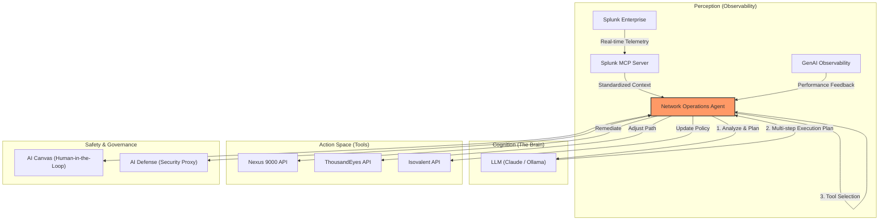

# Vision Document: Evolution to Agentic Architecture

## Phase 2: From Predictive Insights to Autonomous Remediation

### 1. Executive Vision
The current state of the **Digital Twin: Predictive Insights** lab provides superior visibility and forecasting using local AI. The next evolution—**Agentic Architecture**—moves beyond reporting by granting the AI authorized "agency" to interact with the infrastructure, effectively creating a self-healing network ecosystem.

### 2. Conceptual Architecture

### 3. Core Agentic Capabilities

#### **A. Standardized Perception via MCP**
The **Splunk MCP Server** acts as a universal translator. Instead of the agent needing to know complex Splunk REST API calls or SPL syntax, it simply asks the MCP server for "Device Health" or "Recent Anomalies." This decoupling allows the agent to focus on *reasoning* rather than *data retrieval mechanics*.
Instead of a linear script execution, the system maintains a continuous loop. It "perceived" an anomaly in Splunk, "thinks" about a remediation strategy via Ollama, and "acts" via Infrastructure-as-Code (IaC) or direct API calls.

#### **B. Intelligent Tool-Use (Function Calling)**
The Predictive Engine evolves into a **Tool-Enabled Agent**. 
*   **Predictive Phase**: "Interface errors are rising; alert the admin."
*   **Agentic Phase**: "Interface errors are rising. I am calling `isolate_faulty_interface()` and re-routing traffic to ensure 0% packet loss for mission-critical applications."

#### **C. Goal-Oriented Planning**
Agents can handle complex, multi-step tasks.
*   **Task**: "Optimize the network for an upcoming high-bandwidth event."
*   **Agent Plan**: 
    1.  Verify current capacity via ThousandEyes.
    2.  Burst S3 data lake ingestion to AWS.
    3.  Pre-emptively scale buffer limits on primary Nexus trunks.
    4.  Update eBPF filters via Isovalent to prioritize performance.

### 4. Choosing the Right Brain: Claude/MCP vs. Splunk AI Assistant

While Splunk offers a native AI Assistant, the **Claude/MCP Architecture** implemented in this lab provides unique advantages for end-to-end agentic workflows.

| Feature | Claude + Splunk MCP (This Lab) | Splunk AI Assistant |
| :--- | :--- | :--- |
| **Primary Strength** | **Cross-Domain Agency**: Reasons across Splunk, Cisco APIs, and other tools in one loop. | **Deep SPL Expertise**: Specialized in generating and explaining complex SPL queries. |
| **"Managed Service" Fit** | **Extremely High**: Unified interface for "Network + App + Security" management. | **Medium**: Excellent for data analytics, but restricted to the Splunk ecosystem. |
| **Scope of Action** | **Broad**: Can execute remediations in infrastructure (e.g., re-route traffic via Nexus API). | **Narrow**: Focused on analysis and native Splunk dashboarding/config. |
| **Model Flexibility** | **High**: Can use Claude or local LLMs (Ollama) for data sovereignty. | **Low**: Generally tied to Splunk-hosted cloud models. |

### 5. Safety & The "AI Canvas"
In an agentic world, trust is paramount.
- **Human-in-the-Loop**: The **AI Canvas** becomes a collaborative workspace where the agent proposes multi-step "blueprints" for remediation that a human operator can verify and trigger.
- **AI Defense Proxy**: A dedicated security layer that inspects outgoing agent commands to prevent "hallucinated" configurations or unauthorized data access.

### 6. The Managed Service Vision: Natural Language to SPL
The integration of Claude and MCP creates a powerful **Managed Service** opportunity. 

Traditionally, managing Splunk requires deep expertise in **SPL (Splunk Search Language)**. With an agentic architecture:
- **Natural Language Interface**: Partners and customers can simply "talk" to Claude (e.g., *"Show me the top 5 devices by CPU usage"*).
- **Auto-Translation**: Claude translates these goals into accurate SPL queries, executes them via the MCP server, and interprets the results.
- **Skill Democratization**: Tier 1 support engineers or business analysts can now leverage the full power of the Splunk Data Lake without needing a 6-month SPL training course.

### 7. Realized Outcomes (The Showcase)
*   **Zero-Touch Operations**: Common failure patterns are handled autonomously.
*   **Reduced MTTR**: Troubleshooting happens in seconds via natural language.
*   **Governance at Scale (IMPLEMENTED)**: Traced via the **GenAI Observability Dashboard**. [See Tracing Showcase](../hello_agent/docs/walkthrough.md#a-observability-agent-trace)
*   **AI Defense & Security (IMPLEMENTED)**: Runtime protection via a security proxy. [See Security Showcase](./walkthrough.md#showcase-cisco-ai-defense)
*   **Persistent Learning (IMPLEMENTED)**: Agents utilize long-term memory. [See Persistence Showcase](../hello_agent/docs/walkthrough.md#c-persistence-agent-memory)

---
**This document outlines the strategic roadmap for transforming the Digital Twin lab into an industry-leading autonomous agentic platform.**
