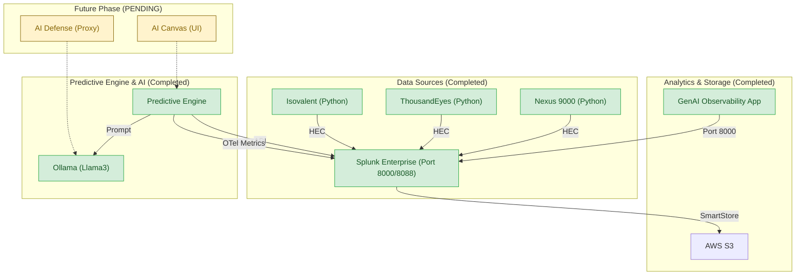

# Implementation Plan - Digital Twin: Predictive Insights Lab

This plan outlines the creation of a lab environment that automates data integration into a digital twin for network performance monitoring and predictive failure forecasting.

## Goals
- [x] Automate data integration from Nexus 9000, ThousandEyes, and Isovalent into Splunk.
- [x] Use Splunk Machine Data Lake (AWS S3) for scalable storage.
- [x] Implement real-time failure forecasting using local LLMs (Ollama).
- [x] Integrate **GenAI Observability** using OpenTelemetry conventions.
- [ ] Implement **AI Canvas** (Web UI) for visualization.
- [ ] Implement **AI Defense** (Guardrail proxy) for LLM security.

## User Review Required
> [!IMPORTANT]
> **AI Canvas** and **AI Defense** are currently marked as **OPEN** items and have not yet been implemented in the current lab version.
> [!CAUTION]
> Avoid running the lab within cloud-synced folders (OneDrive/Dropbox) to prevent Docker permission errors.

## Current Architecture

### 1. Data Collection Layer [COMPLETED]
- **Predictive Data Generators**: Python scripts simulating real-world network and application telemetry.
- **HEC Integration**: Automated Splunk HEC token creation (`bb3b876d-a885-4820-8675-3fb520ac221d`) and port 8088 exposure.

### 2. Analytics & Storage Layer [COMPLETED]
- **Splunk Enterprise**: Optimized for Mac ARM64 via Docker emulation.
- **GenAI Observability for Splunk**: App (ID 7382) installed to monitor LLM token usage and latency.

### 3. Predictive Engine & GenAI [COMPLETED]
- **Ollama**: Local LLM runner hosting **Llama3**.
- **Predictive Engine**: 
    - Queries for Nexus 9000 anomalies.
    - Generates executive-level failure forecasts.
    - Sends **OTel metrics** (`gen_ai.usage.total_tokens`, `gen_ai.client.duration`).

### 4. Portability & Remote Access [COMPLETED]
- **Portability Guide**: New documentation on replicating the lab safely on other machines.
- **Remote Access Choice**: Detailed instructions for **Tailscale**, **ngrok**, and **Local IP** access.

### 5. Open Items (Future Scope) [PENDING]
- **AI Canvas Integration**: A web-based dashboard for viewing insights and executing "AgenticOps".
- **AI Defense Layer**: Guardrails for Ollama API to detect prompt injections and sensitive data leaks.

---

## Proposed Changes (Reference)

### [Component: Documentation]
#### [UPDATE] [walkthrough.md](walkthrough.md)
Updated with Business Executive summary and cost-savings analysis.
#### [NEW] [portability_and_remote_access.md](portability_and_remote_access.md)
New guide for moving and sharing the lab.

## Verification
- [x] Splunk HEC reachable on port 8088.
- [x] `genai:telemetry` data visible in Splunk.
- [x] Ollama generating reports in under 60s.
