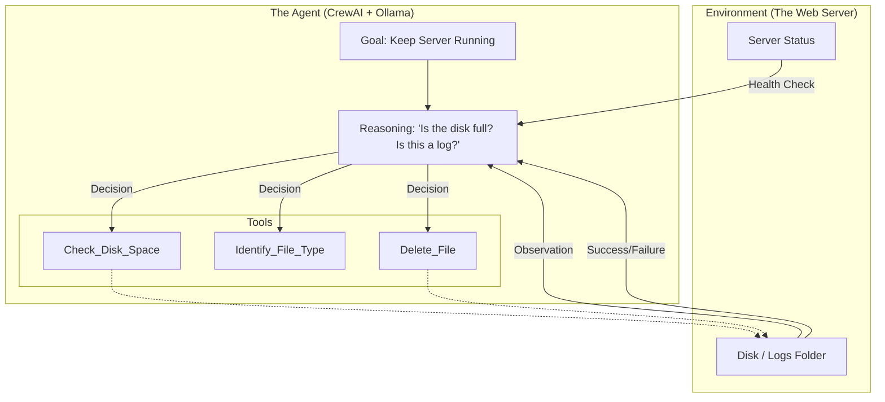

# Logical Diagram: The Agentic Loop

This diagram illustrates how the **Junior Admin Agent** operates compared to a traditional scheduled script.

### Key Differentiators:
1.  **Goal Driven**: The agent starts with the *outcome* (Server Running) and works backward.
2.  **State Aware**: It checks the environment *before* acting using Tools.
3.  **Corrective Feedback**: If a deletion doesn't fix the server, the agent can try a different "tool" or notify a human.
